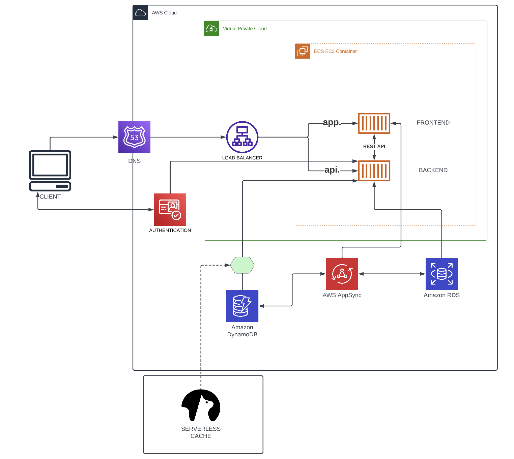
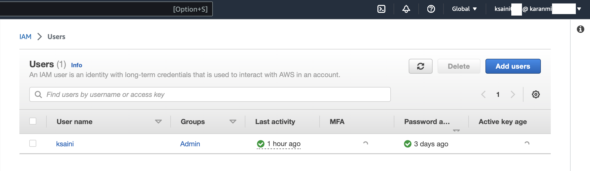
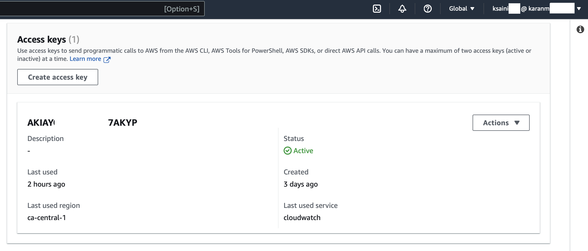

# Week 0 — Billing and Architecture
## Required Homework

### Videos to be watched:

I re-watched the bootcamp video on Youtube to revise what was taught in the class on Saturday.

I also watched Chirag and Ashish's videos to understand the pricing and security concepts with AWS.

### Things to do:

#### Napkin design:

I drew the napkin design for the concept of CRUDDUR App.

Below is the image for the napkin design.

#### Logical Architectural design in Lucid Charts

I drew the logical architectural design in Lucid Charts using the in-built AWS Architectural Shapes in Lucid Charts.

Here is a direct [link](https://lucid.app/lucidchart/7fd2ed3e-9b9c-4f59-8aeb-2d121fc4143d/edit?viewport_loc=-2102%2C-967%2C3055%2C1583%2C0_0&invitationId=inv_300255af-0949-49ee-958e-487900b3ff16) to the Lucid Charts to show proof of work.

Below is the image for the Lucid Charts.

#### Admin user Creation

I successfully created an admin username "ksaini..." using the IAM services under my root account in AWS. I also created an alias name "karanmi....." to enable easy login. 

Below is the image for IAM Access User

#### Access Key Generation

I successfully generated access keys to allow CLI access to AWS CLI in Gitpod.

Below is the image for the generated key.

#### AWS CLI Installation in Gitpod

I successfully installed AWS CLI in Gitpod using the instructions in [Andrew's Github Journal](https://github.com/omenking/aws-bootcamp-cruddur-2023/blob/week-0/journal/week0.md)

I also updated my Gitpod yml file to run the code to install AWS CLI at every new Gitpod Workspace Launch. The yml file is linked [here](https://github.com/ksaini007/aws-bootcamp-cruddur-2023/blob/main/.gitpod.yml)

