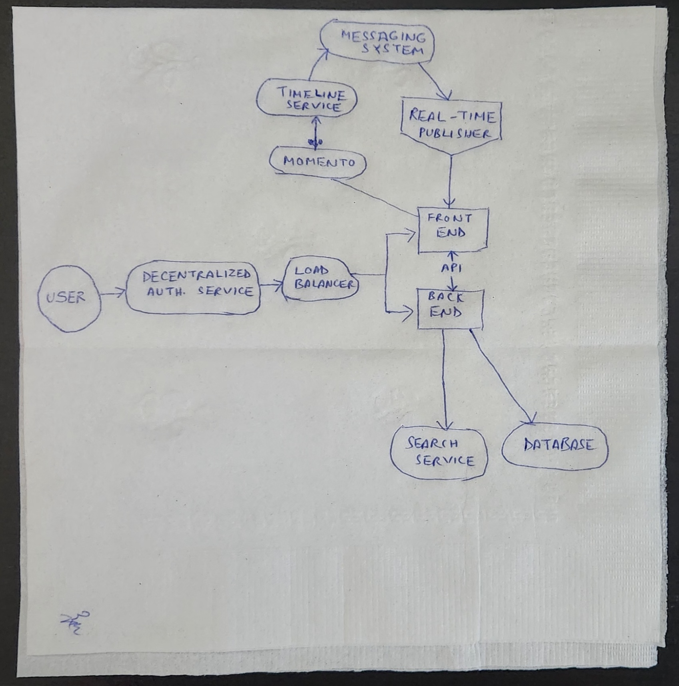

# Week 0 — Billing and Architecture
## Required Homework

### Videos to be watched:

I re-watched the bootcamp video on Youtube to revise what was taught in the class on Saturday.

I also watched Chirag and Ashish's videos to understand the pricing and security concepts with AWS.

### Things to do:

#### Napkin design:

I drew the napkin design for the concept of CRUDDUR App.

Below is the image for the napkin design.

#### Logical Architectural design in Lucid Charts

I drew the logical architectural design in Lucid Charts using the in-built AWS Architectural Shapes in Lucid Charts.

Here is a direct [link](https://lucid.app/lucidchart/7fd2ed3e-9b9c-4f59-8aeb-2d121fc4143d/edit?viewport_loc=-2102%2C-967%2C3055%2C1583%2C0_0&invitationId=inv_300255af-0949-49ee-958e-487900b3ff16) to the Lucid Charts to show proof of work.

Below is the image for the Lucid Charts.

